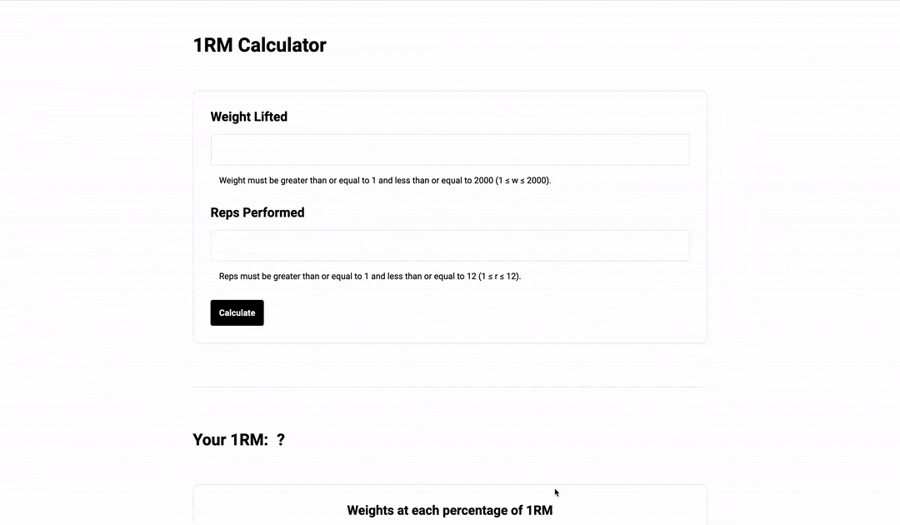

<div align="center">

# One-repetition maximum Calculation Website

**A simple website to calculate 1RM.**

**https://one-rep-max-calc-web.vercel.app**

</div>

<br />

**1RM** is the maximum weight that can be lifted at one time.

> **One-repetition maximum** (**one rep maximum** or **1RM**) in weight training is the maximum amount of weight that a person can possibly lift for one repetition.
> It may also be considered as the maximum amount of force that can be generated in one maximal contraction.[1]
> One repetition maximum can be used for determining an individuals maximum strength and is the method for determining the winner in events such as powerlifting and weightlifting competitions.
> One repetition maximum can also be used as an upper limit, in order to determine the desired "load" for an exercise (as a percentage of the 1RM).
> https://en.wikipedia.org/wiki/One-repetition_maximum

<br />
<br />

## Features

- [x] Get the value of **1RM** by entering values in the form and calling the [API](https://github.com/HirokiTakeshita/1RMCalcAPI).
- [x] Also, you can get the weight at each percentage of 1RM.

<br />

## Demo

- **You can try it out on the [website](https://one-rep-max-calc-web.vercel.app).**



<br />

or

<br />

- **You can try it locally.**


```bash
git clone https://github.com/HirokiTakeshita/1RMCalcWeb.git
cd 1RMCalcWeb
yarn
yarn dev
```


<br />

## Tech Stack
- **Framework: [Next.js](https://nextjs.org)**
- **Deployment: [Vercel](https://vercel.com)**
- **Styling: [Tailwind CSS](https://tailwindcss.com)**

<br />

## License
MIT
